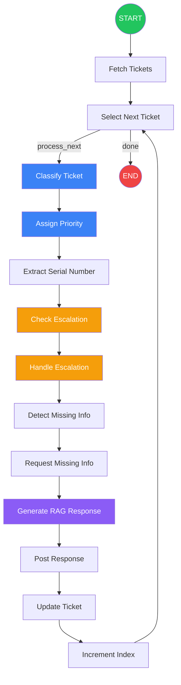
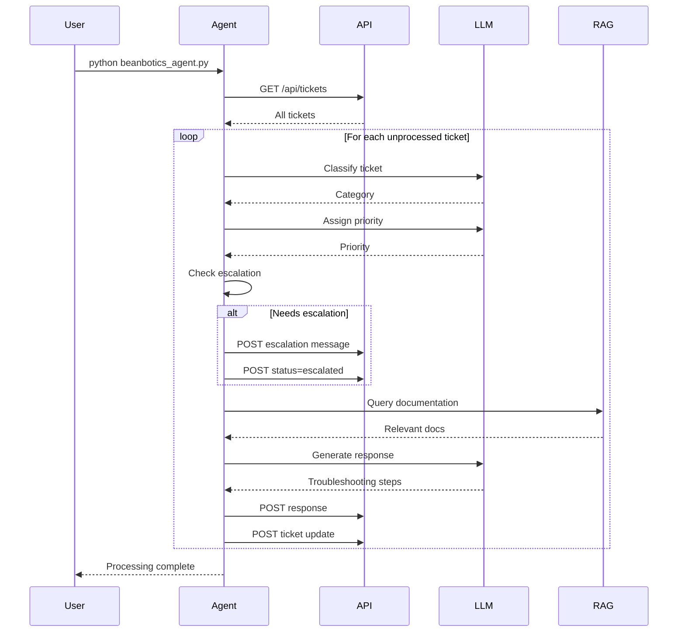
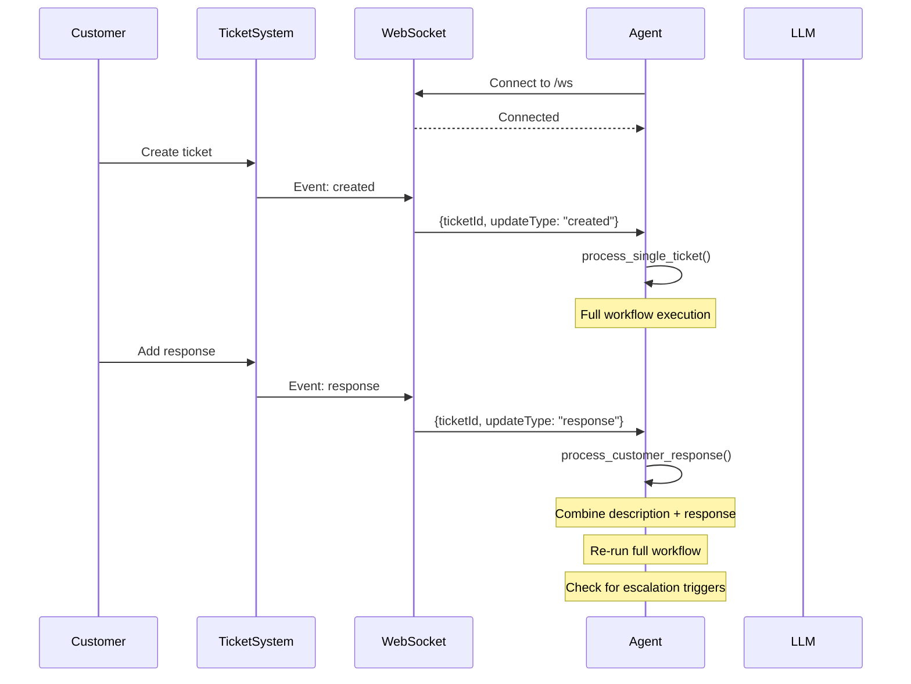
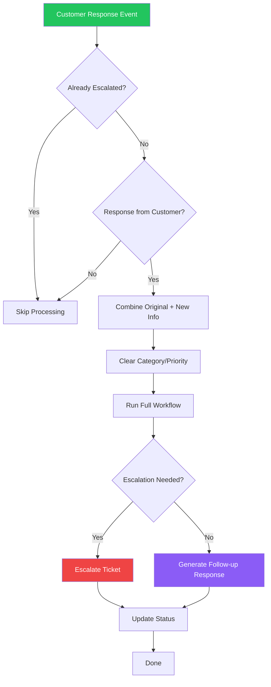
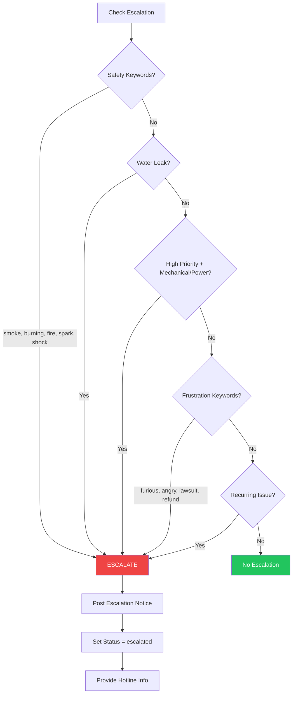
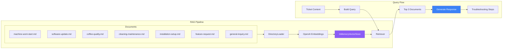

# BeanBotics Support Agent - Workflow Documentation

## Overview

The BeanBotics Support Agent is an automated ticket processing system built with LangGraph. It processes support tickets through a series of nodes that classify, prioritize, and respond to customer issues.

## LangGraph Workflow



## Node Descriptions

### 1. Fetch Tickets
- **Purpose**: Retrieve unprocessed tickets from the ticketing system API
- **Logic**:
  - If tickets are pre-loaded in state (e.g., for re-processing after customer response), use those
  - Otherwise, fetch all tickets and filter for unprocessed ones (missing category or priority)

### 2. Select Next Ticket
- **Purpose**: Pick the next ticket from the queue for processing
- **Routing**:
  - `process_next` - Continue to classification if tickets remain
  - `done` - End workflow if no more tickets

### 3. Classify Ticket
- **Purpose**: Use LLM to categorize the ticket
- **Categories**:
  - Mechanical
  - Coffee Quality
  - Maintenance
  - Technical
  - Power/Startup
  - Installation/Setup
  - Feature Request
  - General Inquiry

### 4. Assign Priority
- **Purpose**: Use LLM to determine urgency level
- **Priority Levels**:
  - **High**: Safety concerns, machine non-functional, water leaks, urgent language
  - **Medium**: Partial functionality, quality concerns, general problems
  - **Low**: Feature requests, general inquiries, non-urgent questions

### 5. Extract Serial Number
- **Purpose**: Find or generate a serial number for the ticket
- **Logic**:
  - Extract from ticket text using regex patterns (BM-1001, S/N:, etc.)
  - Generate deterministic serial if none found

### 6. Check Escalation
- **Purpose**: Determine if human intervention is needed
- **Escalation Triggers**:
  - Safety keywords: smoke, burning, fire, spark, shock, electric, danger
  - Water leak or water damage
  - High priority Mechanical/Power issues
  - Customer frustration indicators
  - Recurring/repeated issues

### 7. Handle Escalation
- **Purpose**: Process escalated tickets
- **Actions**:
  - Post escalation notice to ticket
  - Update ticket status to "escalated"
  - Provide emergency hotline information

### 8. Detect Missing Info
- **Purpose**: Check if critical information is missing
- **Checks**:
  - Serial number presence
  - Description length (minimum 20 characters)
  - Category-specific requirements (bean type for Coffee Quality, lights for Power/Startup, etc.)

### 9. Request Missing Info
- **Purpose**: Post a polite request for additional information
- **Output**: Formatted message listing missing items

### 10. Generate RAG Response
- **Purpose**: Create helpful troubleshooting response using documentation
- **Process**:
  - Query vector store with ticket content
  - Retrieve top 3 relevant documents
  - Generate contextual response with LLM

### 11. Post Response
- **Purpose**: Submit the generated response to the ticket

### 12. Update Ticket
- **Purpose**: Save classification results to the API
- **Fields Updated**: category, priority, serial_number

### 13. Increment Index
- **Purpose**: Move to the next ticket in the queue

---

## Processing Modes

### Batch Mode
Process all unprocessed tickets once and exit.



### WebSocket Real-Time Mode
Continuously listen for new tickets and customer responses.



---

## Customer Response Re-Processing Flow

When a customer responds with new information, the agent re-evaluates the ticket:



---

## Escalation Decision Flow



---

## RAG System Architecture



---

## Configuration

### Environment Variables (secrets.env)

| Variable | Default | Description |
|----------|---------|-------------|
| `OPENAI_API_KEY` | (required) | OpenAI API key for LLM and embeddings |
| `OPENAI_MODEL` | `gpt-4o` | Model to use for classification and responses |
| `TICKETING_API_URL` | `http://localhost:3000` | Ticketing system base URL |

### Running the Agent

```bash
# Batch mode - process all unprocessed tickets once
python beanbotics_agent.py

# Real-time mode - listen for new tickets via WebSocket
python beanbotics_agent.py --watch

# Show help
python beanbotics_agent.py --help
```

---

## API Endpoints Used

| Method | Endpoint | Purpose |
|--------|----------|---------|
| GET | `/api/tickets` | List all tickets |
| GET | `/api/tickets/:id` | Get ticket with responses |
| POST | `/api/tickets/:id` | Update ticket fields |
| POST | `/api/tickets/:id/responses` | Add response to ticket |
| POST | `/api/tickets/:id/status` | Update ticket status |
| WS | `/ws` | WebSocket for real-time events |