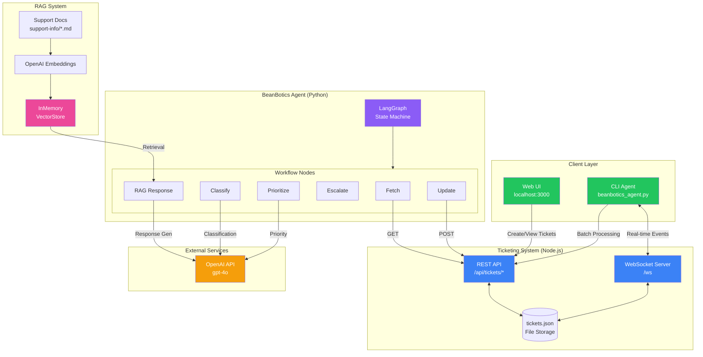
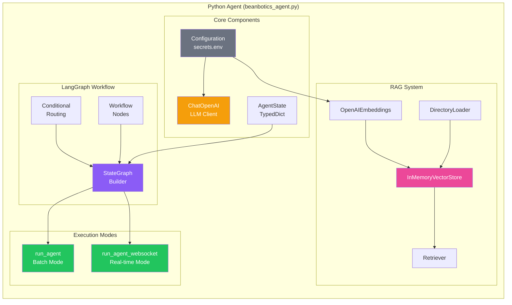
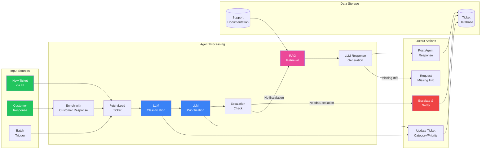
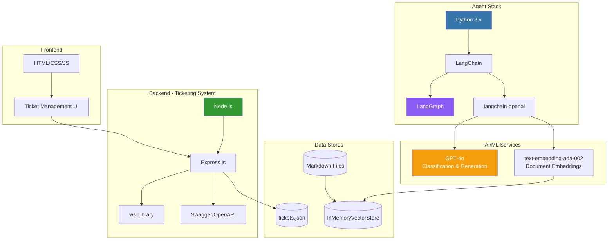
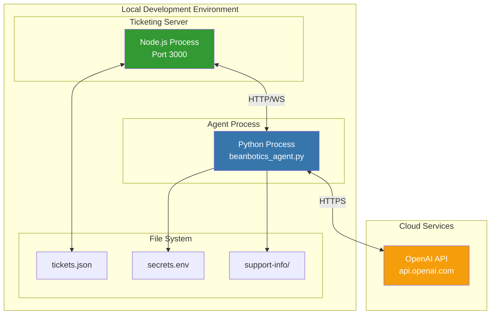
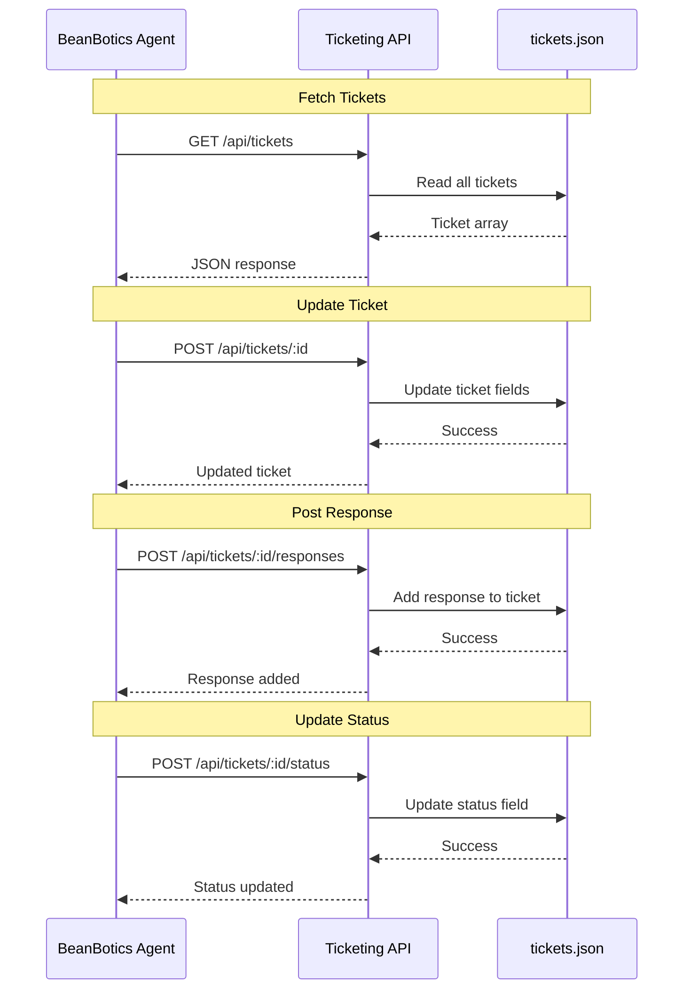
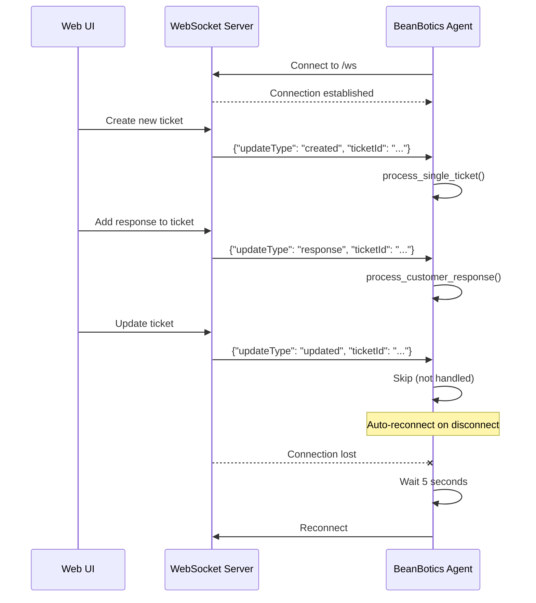
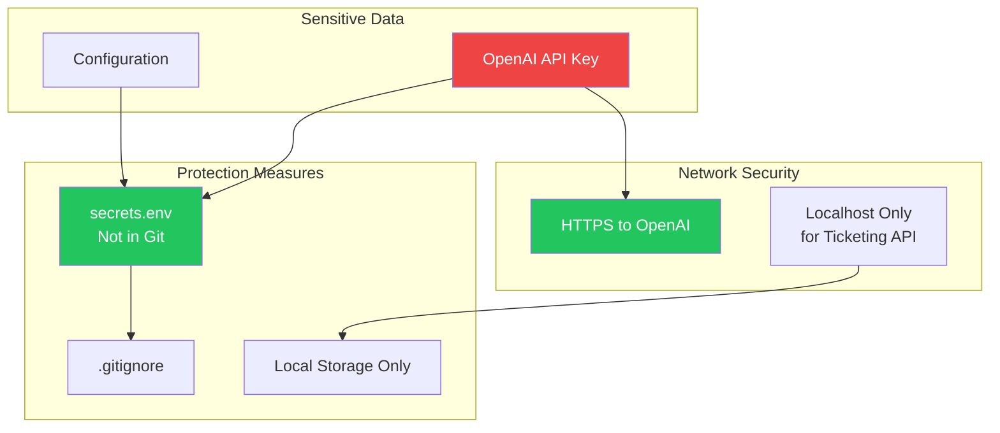

# BeanBotics Support Agent - Architecture Documentation

## System Architecture Overview



---

## Component Architecture



---

## Data Flow Architecture



---

## Technology Stack



---

## Deployment Architecture



---

## State Management

```mermaid
flowchart LR
    subgraph AgentState["AgentState (TypedDict)"]
        direction TB

        subgraph TicketQueue["Ticket Queue"]
            tickets[tickets: List]
            index[current_index: int]
            current[current_ticket: dict]
        end

        subgraph Classification["Classification Results"]
            category[classified_category: str]
            priority[assigned_priority: str]
            serial[extracted_serial: str]
        end

        subgraph Escalation["Escalation State"]
            needs[needs_escalation: bool]
            reason[escalation_reason: str]
        end

        subgraph Response["Response State"]
            rag[rag_response: str]
            missing[missing_info: List]
        end

        subgraph Logging["Logging"]
            log[log: List]
            errors[errors: List]
        end
    end

    Start((Input)) --> tickets
    tickets --> index
    index --> current
    current --> category
    category --> priority
    priority --> serial
    serial --> needs
    needs --> reason
    reason --> rag
    rag --> missing
    missing --> log
    log --> errors
    errors --> End((Output))

    style tickets fill:#22c55e,color:#fff
    style category fill:#3b82f6,color:#fff
    style priority fill:#3b82f6,color:#fff
    style needs fill:#f59e0b,color:#fff
    style rag fill:#8b5cf6,color:#fff
```



---

## API Integration



---

## WebSocket Event Flow



---

## Security Considerations



---

## File Structure

```
capstone/
├── beanbotics_agent.py      # Main agent implementation
├── secrets.env              # Configuration (API keys)
├── AGENT_WORKFLOW.md        # Workflow documentation
├── ARCHITECTURE.md          # This file
│
├── support-info/            # RAG knowledge base
│   ├── machine-wont-start.md
│   ├── software-update.md
│   ├── coffee-quality.md
│   ├── cleaning-maintenance.md
│   ├── installation-setup.md
│   ├── feature-request.md
│   └── general-inquiry.md
│
└── ticketing-system/        # Node.js backend
    ├── index.js             # Express server
    ├── tickets.json         # Ticket storage
    ├── package.json
    └── public/              # Web UI
```